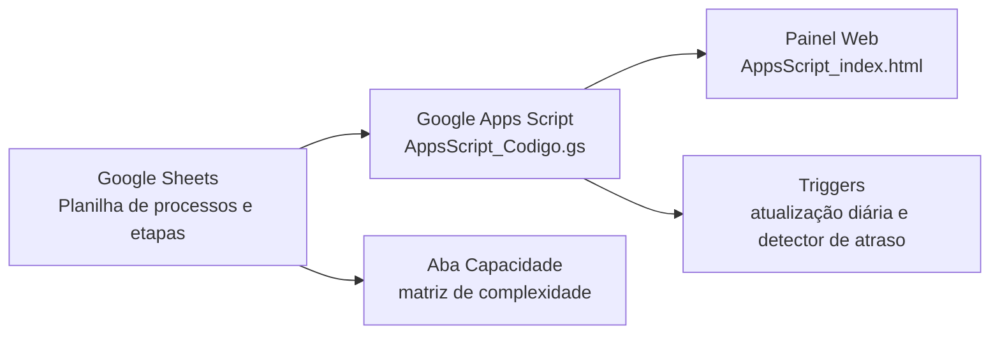

# Painel de Contratações CPII

Sistema de monitoramento do cronograma de contratações públicas desenvolvido para a Seção de Licitações da Reitoria do Colégio Pedro II (DECOF/LIC). O projeto combina uma planilha automatizada no Google Sheets com um painel web em Google Apps Script para acompanhar prazos, etapas, atrasos, capacidade da equipe e situação geral dos processos de contratação.

> Projeto concebido para uso institucional no CPII, com arquitetura simples, sem custo adicional de licenças e adaptável por outras unidades/campi.

## O que o projeto faz

O painel transforma a planilha de controle de contratações em uma visão gerencial interativa, permitindo que a equipe e os setores requisitantes acompanhem o andamento dos processos com mais transparência.

Principais recursos:

- Gráfico de Gantt interativo com processos e etapas.
- Cálculo automático de prazos em dias úteis.
- Propagação de atrasos em cascata para as etapas seguintes.
- Registro de data real de conclusão e motivo do atraso.
- Indicadores de processos em andamento, atrasados, em planejamento e concluídos.
- Filtros por status, modalidade, ano e busca textual.
- Cadastro guiado de novos processos pela própria planilha.
- Detector automático de atraso via trigger do Google Apps Script.
- Indicador de capacidade do setor com matriz de complexidade.
- Planilha-modelo documentada para replicação em outras unidades.

## Por que ele foi criado

A Portaria CPII nº 638/2026 estabeleceu prazos formais para as etapas da fase interna de contratações. O acompanhamento manual desses prazos em planilhas convencionais gerava risco de erro, retrabalho e pouca visibilidade para os setores requisitantes.

Este projeto nasceu para resolver esse problema com uma solução baseada em ferramentas já disponíveis no Google Workspace institucional:

- Google Sheets como base de dados editável pela equipe.
- Google Apps Script como back-end, automação e publicação web.
- HTML, CSS e JavaScript para o painel público.

## Arquitetura



## Estrutura do repositório

```text
.
├── README.md
├── Nota_tecnica_Painel_CPII_v4.docx
├── Guia_Rapido_Painel_SEL.docx
├── PLANO_DIARIO.md
└── Web app/
    ├── AppsScript_Codigo.gs
    ├── AppsScript_index.html
    ├── CronogramaContratacoes_CPII_Final_v2.xlsx
    └── Logo cpii.jpg
```

Arquivos principais:

- `Web app/AppsScript_Codigo.gs`: back-end do Google Apps Script. Lê a planilha, calcula datas, status, atrasos, capacidade e cria menus/triggers.
- `Web app/AppsScript_index.html`: interface web do painel Gantt.
- `Web app/CronogramaContratacoes_CPII_Final_v2.xlsx`: modelo de planilha para importação no Google Sheets.
- `Nota_tecnica_Painel_CPII_v4.docx`: nota técnica com fundamentação, histórico, impacto institucional e enquadramento do projeto.
- `Guia_Rapido_Painel_SEL.docx`: guia operacional para a equipe usuária.

## Como implantar

1. Faça upload da planilha `CronogramaContratacoes_CPII_Final_v2.xlsx` para o Google Drive da unidade.
2. Abra o arquivo no Google Sheets e confirme se as abas foram importadas corretamente.
3. Na planilha, acesse **Extensões > Apps Script**.
4. Cole o conteúdo de `AppsScript_Codigo.gs` no arquivo principal do Apps Script.
5. Crie um arquivo HTML chamado `index` e cole o conteúdo de `AppsScript_index.html`.
6. Salve o projeto.
7. Publique em **Implantar > Nova implantação > App da Web**.
8. Ajuste a função `abrirPainel()` em `AppsScript_Codigo.gs` com a URL publicada do seu Web App.
9. Reabra a planilha e use o menu **Painel SEL** para instalar:
   - trigger diário de atualização;
   - detector automático de atraso.

## Como usar a planilha

A equipe deve editar apenas as células marcadas com `◄ EDITAR`.

Abas principais:

- `📋 Instruções`: manual interno da planilha.
- `Matriz de Pontuação`: critérios de complexidade usados no cálculo de capacidade.
- `📊 Capacidade`: registro de carga por servidor e processos ativos.
- `🏛 Processos`: dados gerais de cada contratação.
- `🗓 Etapas`: etapas, prazos, status, data real e motivo de atraso.
- `Prioridades GUT`: priorização interna da chefia, não exibida no painel público.

Campos essenciais na aba `Processos`:

- `ProcessoID`
- `N° SUAP`
- `Objeto`
- `Modalidade`
- `D0 (Data Abertura)`
- `Link SUAP`
- `Tem IRP?`
- `Status`

Campos editáveis na aba `Etapas`:

- `DataRealizacao◄ EDITAR`
- `MotivoAtraso ◄ EDITAR`
- `StatusEtapa ◄ EDITAR`

## Como adaptar para outra unidade do CPII

O projeto foi pensado para ser reaproveitado por outras unidades/campi com poucos ajustes.

### 1. Copiar a planilha-modelo

Crie uma cópia da planilha e substitua os dados de exemplo pelos processos da sua unidade. Mantenha os nomes dos cabeçalhos, pois o código localiza as colunas pelo texto.

Antes de publicar em repositório público, revise a planilha e remova ou anonimize dados sensíveis, como números de processo, links internos, nomes, matrículas e justificativas reais de atraso.

### 2. Ajustar identidade visual e contatos

No arquivo `AppsScript_index.html`, revise:

- nome da unidade no cabeçalho;
- chip institucional, hoje configurado como `DECOF-LIC`;
- endereço no rodapé;
- ramais;
- e-mail;
- links institucionais do topo;
- logotipo, se a unidade quiser usar outra imagem.

### 3. Ajustar parâmetros do cronograma

No arquivo `AppsScript_Codigo.gs`, revise:

- `ANO_BASE`, caso o painel seja usado em outro exercício;
- `faseExternaDias()`, se os prazos externos forem alterados;
- `FERIADOS_FIXOS`, caso a unidade queira ampliar a lista de feriados;
- etapas padrão dentro de `novoProcesso()`, se o fluxo local tiver diferenças;
- `abrirPainel()`, para apontar para a URL publicada da nova unidade.

### 4. Ajustar capacidade do setor

Na aba `📊 Capacidade`, substitua os nomes dos servidores e os valores fixos conforme a equipe local. A lógica atual usa teto individual de 10 pontos por servidor, mas a matriz pode ser ajustada pela chefia se a unidade adotar outro critério.

### 5. Publicar e testar

Depois de publicar o Web App:

- abra o painel pelo link;
- confira se os processos aparecem;
- teste filtros e expansão de etapas;
- cadastre um processo fictício;
- preencha uma `DataRealizacao`;
- confirme se o detector de atraso registra o motivo corretamente;
- instale os triggers pelo menu da planilha.

## Observações importantes

- O sistema não depende de banco de dados externo.
- O painel lê os dados diretamente da planilha vinculada ao Apps Script.
- O cálculo de prazo usa dias úteis, excluindo fins de semana e feriados nacionais fixos cadastrados no código.
- Feriados móveis e feriados locais podem ser incluídos futuramente.
- O Web App pode ser publicado com acesso restrito à organização ou aberto conforme a política institucional da unidade.

## Base normativa e institucional

O projeto foi desenvolvido considerando:

- Constituição Federal de 1988, art. 37;
- Lei nº 14.133/2021;
- Decreto nº 10.947/2022;
- Portaria CPII nº 638/2026;
- Lei nº 9.784/1999;
- Lei nº 15.367/2026, no contexto de reconhecimento de saberes e competências.

## Autoria

Concepção, coordenação e desenvolvimento:

**Samuel Gomes da Silva**  
Assistente em Administração - DECOF/LIC/CPII

Validação técnica:

**Amanda Carla Faria de Almeida**  
Chefe - DECOF/LIC/CPII

## Status do projeto

O sistema está pronto para uso como referência técnica e pode ser adaptado por outras unidades do Colégio Pedro II. Para publicação pública no GitHub, recomenda-se revisar previamente os arquivos de dados e documentos anexos, mantendo no repositório apenas informações que possam ser divulgadas externamente.
